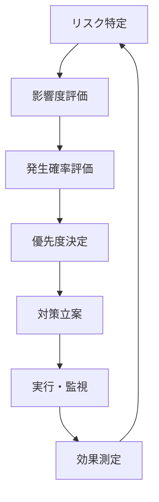

# 株式会社テクノロジー 2024年度第2四半期決算説明資料

## 会社概要

| 項目 | 内容 |
|------|------|
| 会社名 | 株式会社テクノロジー |
| 設立 | 2010年4月1日 |
| 資本金 | 10億円 |
| 従業員数 | 1,250名 |
| 本社所在地 | 東京都港区赤坂1-1-1 |
| 事業内容 | ソフトウェア開発、AI・機械学習ソリューション |

## エグゼクティブサマリー

### 業績ハイライト

2024年第2四半期（7-9月）の業績は、前年同期比で大幅な成長を遂げました：

- **売上高**: 45.2億円（前年同期比 +18.3%）
- **営業利益**: 8.7億円（前年同期比 +24.1%）
- **純利益**: 6.1億円（前年同期比 +31.2%）
- **EBITDA**: 12.3億円（前年同期比 +19.8%）

### 主要な成果

1. ✅ AI製品の売上が全体の62%を占める
2. ✅ 海外売上比率が35%に増加
3. ✅ 新規顧客獲得数が前年同期比40%増
4. 🔄 クラウドサービス移行プロジェクト継続中

## 財務実績詳細

### 損益計算書（単位：百万円）

| 項目 | 2024年Q2 | 2023年Q2 | 増減額 | 増減率 |
|------|----------|----------|--------|--------|
| **売上高** | 4,520 | 3,820 | +700 | +18.3% |
| 売上原価 | 2,710 | 2,365 | +345 | +14.6% |
| **売上総利益** | 1,810 | 1,455 | +355 | +24.4% |
| 販売費及び一般管理費 | 940 | 755 | +185 | +24.5% |
| **営業利益** | 870 | 700 | +170 | +24.3% |
| 営業外収益 | 45 | 38 | +7 | +18.4% |
| 営業外費用 | 25 | 22 | +3 | +13.6% |
| **経常利益** | 890 | 716 | +174 | +24.3% |
| 特別利益 | 15 | 8 | +7 | +87.5% |
| 特別損失 | 35 | 12 | +23 | +191.7% |
| **税引前当期純利益** | 870 | 712 | +158 | +22.2% |
| 法人税等 | 260 | 246 | +14 | +5.7% |
| **当期純利益** | 610 | 466 | +144 | +30.9% |

### 貸借対照表（単位：百万円）

#### 資産の部

| 科目 | 2024年9月末 | 2024年6月末 | 増減 |
|------|-------------|-------------|------|
| **流動資産** | | | |
| 現金及び預金 | 2,150 | 1,980 | +170 |
| 受取手形及び売掛金 | 1,420 | 1,350 | +70 |
| 商品及び製品 | 85 | 92 | -7 |
| 仕掛品 | 145 | 138 | +7 |
| その他 | 295 | 285 | +10 |
| 流動資産合計 | 4,095 | 3,845 | +250 |
| **固定資産** | | | |
| 有形固定資産 | 1,850 | 1,820 | +30 |
| 無形固定資産 | 890 | 875 | +15 |
| 投資その他の資産 | 425 | 415 | +10 |
| 固定資産合計 | 3,165 | 3,110 | +55 |
| **資産合計** | **7,260** | **6,955** | **+305** |

#### 負債・純資産の部

| 科目 | 2024年9月末 | 2024年6月末 | 増減 |
|------|-------------|-------------|------|
| **流動負債** | | | |
| 支払手形及び買掛金 | 680 | 645 | +35 |
| 短期借入金 | 250 | 300 | -50 |
| 未払法人税等 | 185 | 145 | +40 |
| その他 | 395 | 385 | +10 |
| 流動負債合計 | 1,510 | 1,475 | +35 |
| **固定負債** | | | |
| 長期借入金 | 1,200 | 1,250 | -50 |
| その他 | 180 | 175 | +5 |
| 固定負債合計 | 1,380 | 1,425 | -45 |
| **負債合計** | 2,890 | 2,900 | -10 |
| **純資産合計** | 4,370 | 4,055 | +315 |
| **負債・純資産合計** | **7,260** | **6,955** | **+305** |

### キャッシュフロー計算書（単位：百万円）

```
営業活動によるキャッシュフロー          +920
├─ 税引前当期純利益                     870
├─ 減価償却費                          245
├─ 売上債権の増減額                    -70
├─ 仕入債務の増減額                    +35
├─ 法人税等の支払額                   -205
└─ その他                             +45

投資活動によるキャッシュフロー          -185
├─ 有形固定資産の取得による支出        -125
├─ 無形固定資産の取得による支出         -75
└─ その他                             +15

財務活動によるキャッシュフロー          -565
├─ 短期借入金の純増減額               -50
├─ 長期借入金の返済による支出         -50
├─ 配当金の支払額                    -435
└─ その他                            -30

現金及び現金同等物の増減額              +170
現金及び現金同等物の期首残高           1,980
現金及び現金同等物の期末残高           2,150
```

## セグメント別業績

### 事業別売上高（単位：百万円）

| 事業セグメント | 2024年Q2 | 2023年Q2 | 増減率 | 構成比 |
|---------------|----------|----------|--------|--------|
| **AI・機械学習** | 2,800 | 2,100 | +33.3% | 62.0% |
| クラウドサービス | 980 | 820 | +19.5% | 21.7% |
| システム開発 | 520 | 650 | -20.0% | 11.5% |
| コンサルティング | 220 | 250 | -12.0% | 4.8% |
| **合計** | **4,520** | **3,820** | **+18.3%** | **100.0%** |

### 地域別売上高

#### 国内市場

| 地域 | 売上高（百万円） | 前年同期比 | 主要顧客 |
|------|------------------|------------|----------|
| 関東 | 1,850 | +15.2% | 大手製造業、金融機関 |
| 関西 | 680 | +12.8% | 商社、小売業 |
| 中部 | 420 | +8.9% | 自動車関連、化学 |
| その他 | 290 | +18.5% | 地方自治体、中小企業 |
| **国内計** | **2,940** | **+14.1%** | |

#### 海外市場

| 地域 | 売上高（百万円） | 前年同期比 | 現地法人 |
|------|------------------|------------|----------|
| 北米 | 850 | +28.5% | Technology USA Inc. |
| 欧州 | 520 | +32.1% | Technology Europe GmbH |
| アジア | 210 | +45.8% | 現地パートナー経由 |
| **海外計** | **1,580** | **+31.2%** | |

## 研究開発投資

### R&D支出の推移

```python
# 研究開発費の推移（億円）
quarters = ['2023Q1', '2023Q2', '2023Q3', '2023Q4', '2024Q1', '2024Q2']
rd_expense = [3.2, 3.8, 4.1, 4.5, 4.8, 5.2]
revenue_ratio = [8.2, 9.1, 8.8, 9.2, 9.5, 11.5]

# R&D投資対売上高比率の目標: 12%
target_ratio = 12.0
```

| 四半期 | R&D支出（億円） | 売上高比率 | 主要投資分野 |
|--------|-----------------|------------|--------------|
| 2024Q2 | 5.2 | 11.5% | 生成AI、量子コンピューティング |
| 2024Q1 | 4.8 | 9.5% | 機械学習プラットフォーム |
| 2023Q4 | 4.5 | 9.2% | エッジAI、IoTソリューション |
| 2023Q3 | 4.1 | 8.8% | クラウドネイティブ基盤 |

### 特許・知的財産

> **知的財産ポートフォリオ**
> 
> - **特許出願数**: 127件（前年同期比 +38件）
> - **特許登録数**: 89件（前年同期比 +22件）
> - **商標登録**: 15件（新規）
> - **著作権**: 45件（ソフトウェア関連）

主要な技術分野：
1. 🧠 深層学習アルゴリズム（34件）
2. 📊 データ分析・可視化（28件）
3. 🔒 セキュリティ技術（21件）
4. ☁️ クラウドインフラ（19件）
5. 🤖 ロボティクス（14件）

## リスク要因と対策

### 事業リスク分析

#### 高リスク要因

| リスク項目 | 影響度 | 発生確率 | リスク値 | 対策状況 |
|------------|--------|----------|----------|----------|
| AI人材不足 | 高 | 高 | 🔴 9 | 採用強化、育成プログラム |
| 技術標準の変化 | 高 | 中 | 🟡 6 | 技術動向調査、柔軟な開発体制 |
| 競合他社の台頭 | 中 | 高 | 🟡 6 | 差別化技術開発、顧客ロイヤリティ向上 |
| 為替変動 | 中 | 中 | 🟡 4 | ヘッジ取引、現地調達拡大 |

#### 新興リスク

- **AI規制強化**: EU AI Act等の法規制対応
- **データプライバシー**: GDPR、個人情報保護法改正
- **サイバーセキュリティ**: 高度化する脅威への対応
- **地政学的リスク**: 技術輸出管理、貿易摩擦

### 対策実施状況



## 2024年度通期業績予想

### 修正後業績予想

| 項目 | 修正後予想 | 従来予想 | 前年実績 | 増減率 |
|------|------------|----------|----------|--------|
| 売上高（億円） | 185 | 175 | 158 | +17.1% |
| 営業利益（億円） | 36 | 32 | 28 | +28.6% |
| 経常利益（億円） | 37 | 33 | 29 | +27.6% |
| 当期純利益（億円） | 26 | 23 | 20 | +30.0% |

### 修正理由

1. **AI事業の好調**: 生成AI関連需要の急拡大
2. **海外展開加速**: 北米・欧州での受注増加
3. **収益性改善**: 高付加価値サービスの拡大
4. **為替影響**: 円安による海外売上の押し上げ

### 四半期別予想

```
Q1実績  Q2実績  Q3予想  Q4予想   通期予想
 42億円  45億円  48億円  50億円   185億円
  ↑      ↑      ↑      ↑
 +12%   +18%   +15%   +12%     +17%
(前年同期比)
```

## 株主還元方針

### 配当政策

| 項目 | 2024年度予想 | 2023年度実績 | 増減 |
|------|--------------|--------------|------|
| **年間配当金** | 35円 | 30円 | +5円 |
| 中間配当 | 15円 | 12円 | +3円 |
| 期末配当 | 20円 | 18円 | +2円 |
| **配当性向** | 26.9% | 30.0% | -3.1pt |
| 配当利回り | 1.8% | 1.5% | +0.3pt |

### 自己株式取得

> **株主還元強化策**
> 
> 2024年11月1日開催の取締役会において、以下の自己株式取得を決議いたしました：
> 
> - **取得株式数**: 上限 200万株（発行済株式総数の4.8%）
> - **取得価額**: 上限 40億円
> - **取得期間**: 2024年11月5日〜2025年3月31日
> - **取得方法**: 東京証券取引所での市場買付

## ESG取り組み

### 環境（Environment）

#### カーボンニュートラル目標

| 目標年 | CO₂削減率 | 主要施策 | 進捗状況 |
|--------|-----------|----------|----------|
| 2030年 | -50% | 再生可能エネルギー導入 | 🟢 順調 |
| 2040年 | -80% | グリーンデータセンター | 🟡 検討中 |
| 2050年 | Net Zero | 全社カーボンニュートラル | 📋 計画策定中 |

### 社会（Social）

#### ダイバーシティ指標

```
女性管理職比率の推移
2020年: 15.2% ████████
2021年: 18.7% ██████████
2022年: 22.1% ████████████
2023年: 25.6% ██████████████
2024年: 28.3% ████████████████
目標2025年: 30.0% ███████████████████
```

### ガバナンス（Governance）

#### 取締役会構成

| 属性 | 人数 | 比率 | 多様性指標 |
|------|------|------|------------|
| 社内取締役 | 5名 | 50% | 技術・事業経験 |
| 社外取締役 | 4名 | 40% | 独立性確保 |
| 社外監査役 | 1名 | 10% | 財務・法務専門性 |
| **女性比率** | 3名 | 30% | ダイバーシティ |
| **外国人比率** | 1名 | 10% | グローバル視点 |

---

## 質疑応答

**本資料に関するお問い合わせ**

📧 Email: ir@technology.co.jp  
📞 Phone: 03-1234-5678  
🌐 Website: https://www.technology.co.jp/ir

**次回決算発表予定**

📅 2025年1月31日（金）15:00-16:30  
📍 東京国際フォーラム ホールB5  
💻 オンライン同時配信あり

---

*本資料に記載された業績予想等の将来に関する記述は、当社が現在入手している情報及び合理的であると判断する一定の前提に基づいており、実際の業績等は様々な要因により大きく異なる可能性があります。*